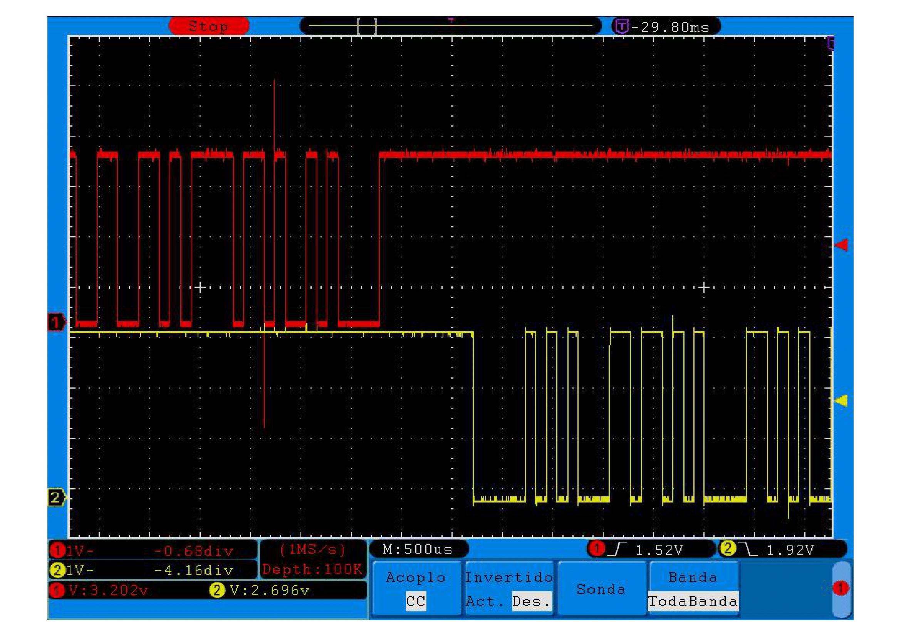
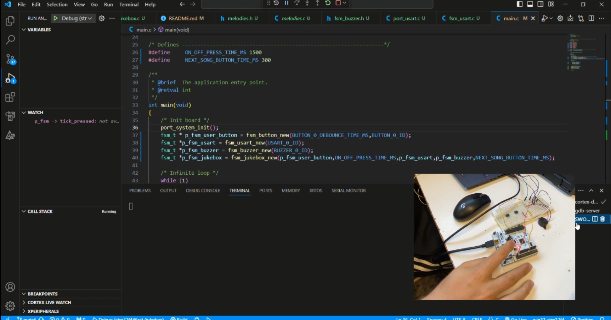

# Jukebox Project 

## Authors

* **Mariano Lorenzo Kayser** - email: [marianolorenzokayser@gmail.com](mailto:marianolorenzokayser@gmail.com)
* **Alejandro Gómez Ruiz** - email: [alejandro.gomez53@alumnos.upm.es](mailto:alejandro.gomez53@alumnos.upm.es)

El proyecto consiste en el desarrollo de un jukebox, que es un reproductor de música capaz de reproducir canciones almacenadas en su memoria. Este jukebox utiliza una Máquina de Estados Finitos (FSM, por sus siglas en inglés) para gestionar su funcionamiento interno y las transiciones entre diferentes estados. La FSM se encarga de controlar el encendido y apagado del jukebox, la reproducción de canciones, la recepción de comandos a través de una interfaz de comunicación USART, entre otras funciones.

El jukebox cuenta con un botón físico para encender y apagar el dispositivo, así como para cambiar entre diferentes canciones almacenadas. Además, puede recibir comandos a través de una conexión USART para controlar la reproducción de la música de manera remota.

The project involves the development of a jukebox, which is a music player capable of playing songs stored in its memory. This jukebox uses a Finite State Machine (FSM) to manage its internal operations and transitions between different states. The FSM is responsible for controlling the jukebox's power on and off, song playback, reception of commands through a USART communication interface, among other functions.

The jukebox has a physical button to turn the device on and off, as well as to switch between different stored songs. Additionally, it can receive commands via a USART connection to remotely control music playback.

Aquí tenemos una captura del osciloscipio donde podemos ver como funciona el modulo de la usart.

Aquí os dejamos un video de como funciona el jukebox tanto en codigo como en la realidad:

## Version 1

En la primera versión nuestra misión fue implementar el botón

### Función del Botón:
El botón permite al usuario interactuar con el jukebox, ofreciendo la funcionalidad de encender o apagar el dispositivo y cambiar entre canciones. La FSM asegura que las pulsaciones del botón se registren correctamente, ignorando los posibles rebotes que puedan generar falsas detecciones de pulsaciones.

### Configuración del botón

| Parámetro        | Valor                       |
|------------------|-----------------------------|
| **Pin**          | PC13                        |
| **Modo**         | Entrada                     |
| **Pull up/down** | No push no pull             |
| **EXTI**         | EXTI13                      |
| **ISR**          | EXTI15_10_IRQHandler()      |
| **Prioridad**    | 1                           |
| **Subprioridad** | 0                           |
| **Tiempo anti-rebotes** | 100 – 200 ms           |

### Descripción General de la FSM del Botón
La Máquina de Estados Finitos (FSM) del botón se encarga de gestionar las pulsaciones del botón y manejar los rebotes que puedan ocurrir durante estas pulsaciones. La FSM tiene varios estados que permiten identificar cuándo el botón ha sido presionado y cuándo ha sido liberado, asegurándose de que los rebotes no interfieran en la detección correcta de estos eventos.

Estados Principales de la FSM del Botón:

BUTTON RELEASED: Estado inicial donde se monitorea si el botón ha sido presionado.

BUTTON PRESSED WAIT: Manejo del anti-rebote después de detectar una pulsación.

BUTTON PRESSED: El botón está presionado y se espera a que sea liberado.

BUTTON RELEASED WAIT: Manejo del anti-rebote después de detectar que el botón ha sido liberado.

## Version 2
Durante la versión dos nuestra misión fue hacer la USART que comunicara el microcontrolador con el ordenador.

### Función del USART:
La USART permite la comunicación remota con el jukebox, recibiendo comandos para controlar la reproducción de la música. Esta funcionalidad es crucial para integrar el jukebox con otros sistemas o interfaces de usuario que necesiten enviar comandos al dispositivo, como es el ordenador que utilizamos en esta práctica, asegurando una comunicación efectiva y precisa.

### Configuración de la USART:

| Parámetro        | Valor                     |
|------------------|---------------------------|
| **Baudrate**     | 9600                      |
| **Bits de Datos**| 8                         |
| **Bits de Stop** | 1                         |
| **Paridad**      | No                        |
| **Control de Flujo** | No                    |
| **USART**        | USART3                    |
| **Pines**        | PB10 (TX) y PC11 (RX)     |
| **Modo**         | Alternativo (ambas)       |
| **Pull up/down** | Pull up (ambas)           |
| **ISR**          | USART3_IRQn()             |
| **Prioridad**    | 2                         |
| **Subprioridad** | 0                         |

### Descripción General de la FSM del USART

La Máquina de Estados Finitos (FSM) del USART gestiona la comunicación serie, controlando tanto la recepción como la transmisión de datos. La FSM asegura que los datos se reciban y envíen correctamente a través de la interfaz USART.

Estados Principales de la FSM del USART:

WAIT DATA: Estado inicial donde se espera la recepción de datos.

SEND DATA: Estado de transmisión de datos almacenados en el buffer de salida.

## Version 3
### Breve descripción de la versión 3.
En la tercera versión del proyecto Jukebox, nuestro objetivo es reproducir melodías almacenadas en la memoria del microcontrolador. Estas melodías monofónicas se reproducirán utilizando un zumbador (buzzer) conectado a una salida del microcontrolador, la cual genera una señal PWM.

### Función del Buzzer:
El buzzer permite la reproducción de melodías mediante la generación de señales PWM que controlan la frecuencia y la duración de las notas musicales. Esta funcionalidad es esencial para transformar las melodías almacenadas en memoria en sonido audible, brindando la capacidad de tocar canciones predefinidas.

#### Configuración de la Frecuencia de las Notas

| Parámetro        | Valor                     |
|------------------|---------------------------|
| *Pin*          | PA6                       |
| *Modo*         | Alternativo               |
| *Pull up/down* | Sin pull                  |
| *Temporizador* | TIM3                      |
| *Canal*        | (ver la tabla de Función Alternativa en el datasheet) |
| *Modo PWM*     | Modo PWM 1                |
| *Prescaler*    | (depende de la frecuencia de la nota que se reproduce) |
| *Periodo*      | (depende de la frecuencia de la nota que se reproduce) |
| *Ciclo de trabajo* | 50%                    |

Esta configuración permite controlar la frecuencia de las notas musicales reproducidas por el buzzer, ajustando los parámetros del temporizador TIM3 para generar la señal PWM adecuada.

#### Configuración de la Duración de las Notas

| Parámetro        | Valor                     |
|------------------|---------------------------|
| *Temporizador* | TIM2                      |
| *Prescaler*    | (depende de la duración de la nota que se reproduce) |
| *Periodo*      | (depende de la duración de la nota que se reproduce) |
| *ISR*          | TIM2_IRQHandler()         |
| *Prioridad*    | 3                         |
| *Subprioridad* | 0                         |

El temporizador TIM2 se utiliza para controlar la duración de cada nota, con una prioridad de interrupción menor que la del resto de interrupciones utilizadas hasta ahora. Esto garantiza que los comandos y acciones del botón tengan prioridad sobre la reproducción de una nota.

### Descripción General de la FSM del Jukebox

La Máquina de Estados Finitos (FSM) del Jukebox gestiona la reproducción de melodías, asegurando que las notas se reproduzcan correctamente y en el orden adecuado. La FSM coordina el uso de los temporizadores TIM2 y TIM3 para controlar tanto la frecuencia como la duración de las notas, garantizando una reproducción fluida y precisa de las melodías.

### Estados Principales de la FSM del Buzzer
1. *WAIT_START*: 
   - *Descripción*: Estado inicial donde el sistema espera la orden de comenzar la reproducción de la melodía.
   - *Transición*: Se pasa al estado WAIT_NOTE cuando se cumple la condición check_player_start, que indica que se ha iniciado la reproducción.

2. *WAIT_NOTE*: 
   - *Descripción*: Estado en el que se espera que termine la duración de la nota actual.
   - *Transición*: Se pasa al estado PLAY_NOTE cuando se cumple la condición check_note_end, indicando que la nota actual ha terminado y es hora de reproducir la siguiente.

3. *PLAY_NOTE*: 
   - *Descripción*: Estado donde se reproduce la nota actual.
   - *Transición*:
     - Se regresa al estado WAIT_NOTE cuando se cumple la condición check_play_note, lo que indica que se debe esperar la finalización de la nota actual.
     - Se pasa al estado WAIT_START si se cumple la condición check_player_stop, indicando que se ha detenido la reproducción.
     - Se pasa al estado PAUSE_NOTE cuando se cumple la condición check_pause, lo que indica que la reproducción se ha pausado.
     - Se pasa al estado WAIT_MELODY si se cumple la condición check_end_melody, indicando que la melodía ha terminado.

4. *PAUSE_NOTE*: 
   - *Descripción*: Estado donde la reproducción de la nota actual está en pausa.
   - *Transición*: Se regresa al estado PLAY_NOTE cuando se cumple la condición check_resume, indicando que la reproducción se ha reanudado.

5. *WAIT_MELODY*: 
   - *Descripción*: Estado en el que se espera la señal para comenzar la reproducción de una nueva melodía.
   - *Transición*: Se pasa al estado WAIT_NOTE cuando se cumple la condición check_melody_start, indicando que se ha iniciado la reproducción de una nueva melodía.

### Implementación de la FSM del Buzzer

La FSM del Buzzer en esta versión del proyecto Jukebox es responsable de gestionar las transiciones entre los diferentes estados, asegurando una reproducción correcta y fluida de las melodías. Las acciones asociadas a cada estado y las condiciones de transición están cuidadosamente diseñadas para manejar eventos como el inicio, pausa, y finalización de la reproducción, así como la gestión de interrupciones y priorización de comandos.

Con esta configuración y la implementación de la FSM, el sistema Jukebox es capaz de reproducir melodías almacenadas en memoria, respondiendo a comandos externos y asegurando un control preciso sobre la reproducción de cada nota.

## Version 4
### Modos de Bajo Consumo
La funcionalidad de los modos de bajo consumo se enfoca en desactivar componentes innecesarios del microcontrolador cuando no están en uso, permitiendo que el sistema se despierte solo ante interrupciones específicas, como pulsaciones de botones o la recepción de mensajes. En esta versión, implementamos las funciones necesarias para gestionar el modo stop de bajo consumo en nuestro sistema.

### Consideraciones Iniciales
Desactivación del SysTick en modo de bajo consumo para evitar que despierte el sistema cada 1 ms.
Reactivación del SysTick a través de las interrupciones externas generadas por el botón y el USART.
La FSM del botón está inactiva en el estado BUTTON_RELEASED.
La FSM del USART está inactiva en el estado WAIT_DATA.
La FSM del buzzer está activa en el estado PLAY_NOTE e inactiva en el resto.
### Descripción General de la FSM del Jukebox
La Máquina de Estados Finitos (FSM) del Jukebox gestiona tanto la reproducción de melodías como la transición a modos de bajo consumo. Esta FSM coordina el uso de los temporizadores y la gestión de interrupciones para optimizar el consumo de energía, manteniendo el sistema en modo de bajo consumo cuando no está activo.

Estados Principales de la FSM del Jukebox
1. ### OFF:

- *Descripción*: Estado inicial donde el sistema está apagado.
- *Transición*:
Se pasa al estado START_UP cuando se cumple la condición check_on, indicando que el sistema se ha encendido.
Se pasa al estado SLEEP_WHILE_OFF si se cumple la condición check_no_activity, indicando que no hay actividad.
2. ### SLEEP_WHILE_OFF:

- *Descripción*: Estado en el que el sistema está dormido mientras está apagado.
- *Transición*:
Permanece en el mismo estado si se cumple la condición check_no_activity.
Se pasa al estado OFF si se cumple la condición check_activity.
3. ### START_UP:

- *Descripción*: Estado donde el sistema se está iniciando.
- *Transición*:
Se pasa al estado WAIT_COMMAND cuando se cumple la condición check_melody_finished, indicando que la inicialización ha terminado.
4. ### WAIT_COMMAND:

- *Descripción*: Estado en el que el sistema espera un comando o la pulsación del botón para cambiar de canción.
- *Transición*:
Permanece en el mismo estado si se cumple la condición check_next_song_button, indicando que se ha pulsado el botón de siguiente canción.
Permanece en el mismo estado si se cumple la condición check_command_received, indicando que se ha recibido un comando.
Se pasa al estado SLEEP_WHILE_ON si se cumple la condición check_no_activity, indicando que no hay actividad.
Se pasa al estado OFF si se cumple la condición check_off, indicando que el sistema se ha apagado.
5. ### SLEEP_WHILE_ON:

- *Descripción*: Estado en el que el sistema está dormido mientras está encendido.
- *Transición*:
Permanece en el mismo estado si se cumple la condición check_no_activity.
Se pasa al estado WAIT_COMMAND si se cumple la condición check_activity, indicando que hay actividad.

### Implementación de la FSM del Jukebox
La FSM del Jukebox en esta versión gestiona las transiciones entre los diferentes estados, asegurando una reproducción correcta y eficiente de las melodías, así como la optimización del consumo de energía mediante la implementación de modos de bajo consumo. Las acciones asociadas a cada estado y las condiciones de transición están diseñadas para manejar eventos como el inicio, pausa, y finalización de la reproducción, así como la gestión de interrupciones y priorización de comandos.

Con esta configuración y la implementación de la FSM, el sistema Jukebox es capaz de reproducir melodías almacenadas en memoria, responder a comandos externos y optimizar el consumo de energía, asegurando un control preciso y eficiente sobre la reproducción de cada nota y el consumo del sistema.

## Version 5
1. En esta versión hemos implementado varias funcionalidades. La primera de ellas ha sido incluir en el módulo common\src\melodies las siguientes melodias:
- **himno_madrid_melody**
- **windows_shutdown_meLody**

2. La segunda, ha sido incluir en la función **_execute_command** perteneciente a common\src\fsm_jukebox.c la opción "lista", la cual imprime por pantalla el número de melodias guardadas.

[

3. La tercera consiste en modificar el debounce-time de nuestro jukebox y en vez pedirselo a la common\src\fsm_button.c pedirselo al port\stm32f4\src\port_button.

4. Y por ultimo, hemos implementado que cuando se apague el sistema, suene la melodía ya mencionada windows_shutdown_melody durante unos segundos hasta finalmente apagarse.
